# Protocol Details

This document describes the implementation details of **NASPIP** and its use cases. It is divided into the following sections:
1. NASPIP Token Format
2. Security: Signing and Verification
3. Data Structure
4. Use Cases

**NASPIP** covert the main payment flows (open/close amount and  dynamic and static payment data), but also handles when there is different payment methods tipically in blockchain.

## Payment Flows

### Dynamic Open/Close Amount

```mermaid
sequenceDiagram
    participant Payer as 💳 Payer
    participant NASPIP as 🧩 NASPIP Protocol
    participant Collector as 🛒 Collector <br>(Merchant)

    %% Proceso de creación y firma del token
    Collector->>NASPIP: Payment Instructions<br/>(Open/Close Amount)
    NASPIP-->>Collector: 🔑 NASPIP Token Generated <br/> (Sign with Private Key)

    %% Compartir token con el Payer
    Collector->>Payer: 📤 Share NASPIP Token
    Payer->>NASPIP: 🔑 Verify NASPIP Token<br/>(Public Key Verification)
    NASPIP-->>Payer: ✅ Get Payment Instructions <br/>(Token Verified)

    %% Ejecución del pago y confirmación
    Payer->>Payer: 💸 Execute Payment
    Collector-->>Collector: ✅ Confirm Payment
```

### URL Payment

```mermaid
sequenceDiagram
    participant Payer as 💳 Payer
    participant NASPIP as 🧩 NASPIP Protocol
    participant Collector as 🛒 Collector <br>(Merchant)

    %% Proceso de creación y firma del token
    Collector->>NASPIP: URL to get Payment Information <br/>(Dynamic or Static)
    NASPIP-->>Collector: 🔑 NASPIP Token Generated <br/> (Sign with Private Key)

    %% Compartir token con el Payer
    Collector->>Payer: 📤 Share NASPIP Token
    Payer->>NASPIP: 🔑 Verify NASPIP Token<br/>(Public Key Verification)
    NASPIP-->>Payer: ✅ URL Payload <br/>(Token Verified)

    %% Obtener instrucciones y ejecución
    Payer->>Collector: 🌐 Request GET URL
    Collector-->>Payer: 📥 Payment Instructions Validated

    %% Ejecución del pago y confirmación
    Payer->>Payer: 💸 Execute Payment
    Collector-->>Collector: ✅ Confirm Payment
```

### URL Payment with Options

```mermaid
sequenceDiagram
    participant Payer as 💳 Payer
    participant NASPIP as 🧩 NASPIP Protocol
    participant Collector as 🛒 Collector <br>(Merchant)

    %% Proceso de creación y firma del token
    Collector->>NASPIP: URL with Payment Options and Order<br/>(Dynamic or Static)
    NASPIP-->>Collector: 🔑 NASPIP Token Generated <br/> (Sign with Private Key)

    %% Compartir token con el Payer
    Collector->>Payer: 📤 Share NASPIP Token
    Payer->>NASPIP: 🔑 Verify NASPIP Token<br/>(Public Key Verification)
    NASPIP-->>Payer: ✅ URL Payload with Payment Options<br/>(Token Verified)

    %% Obtener instrucciones y ejecución
    Payer->>Payer: ✍️Choose a payment option
    Payer->>Collector: 🌐 Request GET URL?payment_option={your_option}
    Collector-->>Payer: 📥 Payment Instructions Validated

    %% Ejecución del pago y confirmación
    Payer->>Payer: 💸 Execute Payment
    Collector-->>Collector: ✅ Confirm Payment
```

